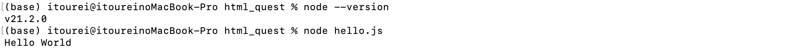

# JavaScriptについて説明できる


## JavaScriptとは

JavaScriptとは、画面に動きをつけることができる

何か、ボタンクリックやキーボード入力などの操作があった時に、
それを認識し、特定の操作に対して、特定の動きをするようにできる


## ECMAScriptとは

ECMAScriptとは、


## 環境構築

`
3.Node.js をインストールし、コマンドラインで実行する
`

を選択


### 結果



### 過程


1. nvmのインストール

```
curl -o- https://raw.githubusercontent.com/nvm-sh/nvm/v0.39.0/install.sh | bash
source ~/.zshrc
```

2. NodeJSのインストール

```
nvm install node
```

3. スクリプトファイル作成

4. ターミナルで実行

```
node app.js
```


### ファイル内容

hello.html
```
<!DOCTYPE html>
<html lang="ja">

<head>
  <meta charset="UTF-8">
  <meta name="viewport" content="width=device-width, initial-scale=1">
  <title>JavaScript学習</title>
</head>

<body>
  <script src="hello.js"></script>
</body>

</html>
```

hello.js
```
console.log('Hello World');
```


